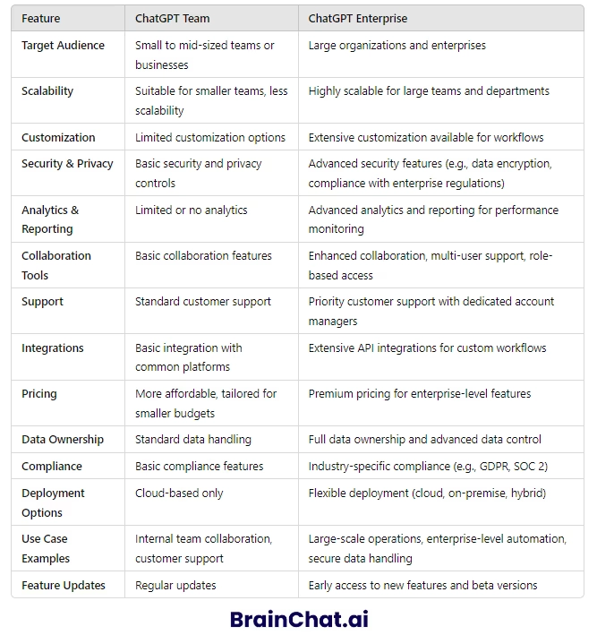
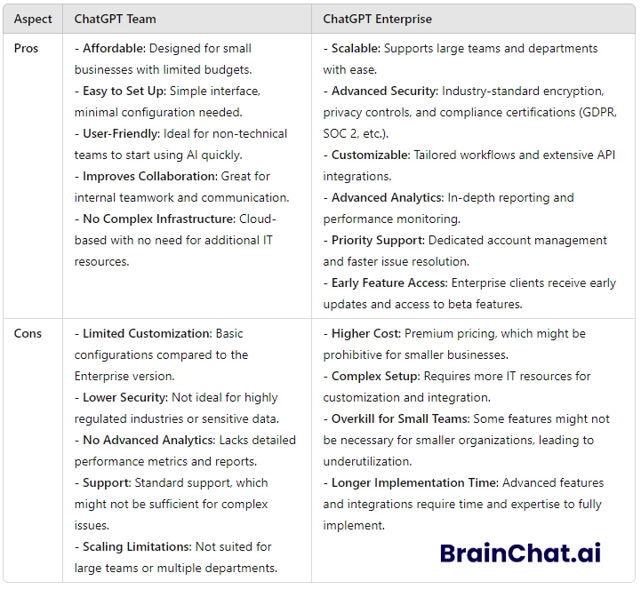

# ChatGPT Team与Enterprise版本详细对比：中小团队和大企业该如何选择？

---

最近身边不少朋友问我：公司想上AI工具，ChatGPT的Team版和Enterprise版到底选哪个？说实话，这问题挺实在的——选错了要么浪费预算，要么功能不够用。

简单说，**ChatGPT Team适合20人以下的小团队快速上手协作，每月30美元/人起；Enterprise则是为150人以上大企业准备的，安全性、定制化和数据管理能力都是另一个级别**。但具体到你的业务场景，还得看几个关键点。接下来我就把这两个版本拆开来讲，看完你就知道该怎么选了。

---

## ChatGPT Team版本：小团队的高性价比选择

.avif)

ChatGPT Team说白了就是给中小团队用的协作工具。你可以理解为"加强版的个人账号+团队工作区"，几个人一起用，共享对话记录和知识库，效率会高很多。

### Team版本的核心特点

- **为小团队量身定制**：最少2人起订，适合10-30人规模的团队，不用像企业版那样起步就要150人
- **上手几乎零门槛**：界面和个人版差不多，不需要IT部门培训就能用起来
- **定制化选项有限**：基本够用但不能深度改造，满足日常工作场景没问题
- **价格相对友好**：每人每月30美元起步（至少2个席位），对创业公司来说压力不大

说实话，**如果你的团队主要需求是内容创作、客户沟通、头脑风暴这些场景，Team版本完全够用**。我见过一个5人的设计工作室用Team版本做文案策划和客户提案，效率直接翻倍。不过要注意，如果你需要接入自己的业务系统或者有严格的数据合规要求，Team版可能就有点力不从心了。

👉 如果你的团队规模不大但想快速体验AI协作的效果，不妨先试试[**ChatGPT会员账号（质保30天）**](https://shaoyumi.com/buy/65)，验证一下使用场景再决定是否升级。

---

## ChatGPT Enterprise版本：大企业的重武器

Enterprise版本就是另一个画风了。这是OpenAI专门为大型企业打造的版本，功能、安全性和服务级别都跟Team版拉开了明显差距。

### Enterprise版本的核心特点

- **企业级安全保障**：数据加密、GDPR合规、私有部署选项，敏感行业也能放心用
- **几乎无限扩展**：支持数千人同时使用，跨部门协作没有性能瓶颈
- **深度定制能力**：可以根据行业特性调整模型，接入现有业务系统
- **7x24小时专属支持**：配备客户经理，有问题随时响应
- **强大的API集成**：能和你现有的CRM、ERP、数据平台无缝对接

对于金融、医疗、法律这些对数据安全要求极高的行业来说，Enterprise版本提供的合规性和定制化能力基本是刚需。而且它的上下文窗口更长，处理复杂任务时明显更稳定。

---

## 两个版本的关键差异一览

说实话，从功能列表上看差异挺明显：

**用户规模**：Team版最少2人，适合小团队；Enterprise起步150人，按梯度计费

**价格结构**：Team是30美元/人/月透明定价；Enterprise需要联系销售报价，通常按年签

**安全合规**：Team有基础加密；Enterprise提供完整的企业级安全方案和合规认证

**定制化程度**：Team基本是标准配置；Enterprise可以深度调整模型和工作流

**技术支持**：Team是常规支持渠道；Enterprise配专属客户经理和优先响应

**系统集成**：Team的API能力有限；Enterprise支持复杂的业务系统对接

如果你是20人规模的创意团队，需要AI帮忙做内容和客户沟通，Team版完全够用；但如果你是500人的跨国公司，需要AI接入十几个业务系统还要保证数据合规，那Enterprise版才是正确选择。

---

## Team版本适合什么场景？

1. **初创公司和小型企业**：刚起步的团队用Team版性价比最高，功能够用又不会占用太多预算
2. **跨部门协作项目**：市场、销售、内容团队可以共享AI能力，头脑风暴和文档协作效率明显提升
3. **客户服务场景**：用AI处理常见问题、辅助客服人员快速响应，小规模客服团队的效率能提升50%以上

我之前遇到一个做海外营销的小团队，用Team版生成多语言内容和社媒文案，一个月下来节省了至少40%的人力成本。

---

## Enterprise版本适合什么场景？

1. **大型企业集团**：几千人的公司可以让不同部门同时使用，不用担心性能问题，而且有分层管理机制
2. **高合规要求行业**：金融、医疗、法律这些领域必须严格遵守数据法规，Enterprise的安全认证是必需的
3. **复杂业务流程自动化**：需要AI深度介入客服系统、法务文档、产品研发等场景，定制化能力是关键
4. **数据分析和决策支持**：Enterprise提供详细的使用报告和性能指标，帮助管理层优化运营

有个做供应链管理的企业客户，用Enterprise版本接入了采购、物流、财务三个系统，自动化处理订单审批和异常预警，运营效率直接上了一个台阶。

---

## 两个版本的优缺点总结

**Team版本的优势**：价格透明、上手快、对小团队友好、不需要复杂配置

**Team版本的局限**：用户数有上限、定制化选项少、安全级别相对基础、API能力有限

**Enterprise版本的优势**：几乎无限扩展、企业级安全、深度定制、专属技术支持、完整API能力

**Enterprise版本的局限**：起步门槛高（至少150人）、价格不透明需要议价、部署和配置相对复杂

选择的核心逻辑其实就一句话：**小团队看性价比，大企业看安全性和扩展性**。

---

## 到底该怎么选？实用决策清单

如果你还在纠结，可以按这几个维度快速判断：

- **团队规模**：30人以下选Team；100人以上考虑Enterprise
- **预算限制**：月度预算紧张选Team；愿意为高级功能付费选Enterprise
- **安全需求**：敏感数据行业必须上Enterprise；一般业务Team够用
- **定制化要求**：标准场景用Team；需要深度改造工作流选Enterprise

实在拿不准的话，建议先用Team版本试运行2-3个月，验证实际使用场景和ROI，再决定是否升级。大部分公司其实不需要一开始就上Enterprise，除非你确定业务复杂度和合规要求必须用到那些高级功能。

如果你想低成本测试ChatGPT在团队中的实际效果，可以先从[**ChatGPT会员一个月成品号（质保30天）**](https://shaoyumi.com/buy/65)开始，这样能快速验证使用场景再做长期规划。

---

## 最后说两句

选ChatGPT Team还是Enterprise，说到底还是看你公司的实际情况。**Team版适合小团队快速启动，Enterprise版适合大企业深度整合**。没有绝对的好坏，只有适不适合。

我的建议是：别想太多，先用起来。很多公司一开始纠结半天配置和功能，结果拖了几个月还没上线，竞争对手早就用AI把效率拉开了。从Team版本开始试水，确认有效果再升级到Enterprise，这条路线对大多数公司来说最稳妥。

AI工具的核心价值在于实际使用，而不是功能列表上的参数对比。找到适合你团队规模和业务场景的版本，快速上手才是王道。如果你的公司正处于快速增长期，想用AI提升团队效率但又不想一次性投入过高成本，👉 [**ChatGPT会员一个月成品号（质保30天）**](https://shaoyumi.com/buy/65)可能是个不错的过渡方案——既能验证使用场景，又能控制初期成本。
